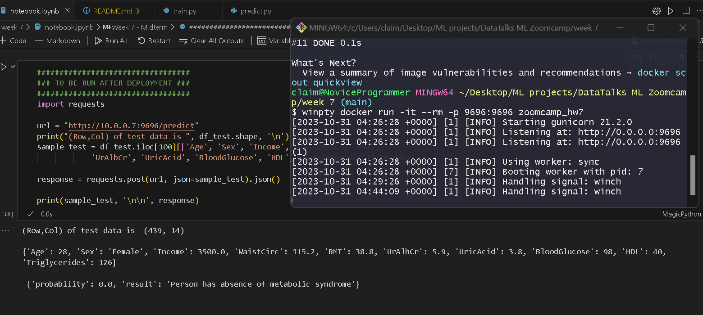

# DataTalks ML Zoomcamp Week 7 - Midterm  

For the midterm project, I have chosen to apply my knowledge using the data about [Metabolic Syndrome from Kaggle](https://www.kaggle.com/datasets/antimoni/metabolic-syndrome). The information about dataset from Kaggle is as follows:  
"This dataset contains information on individuals with metabolic syndrome, a complex medical condition associated with a cluster of risk factors for cardiovascular diseases and type 2 diabetes. The data includes demographic, clinical, and laboratory measurements, as well as the presence or absence of metabolic syndrome.  

Column Descriptors:

- seqn: Sequential identification number.
- Age: Age of the individual.
- Sex: Gender of the individual (e.g., Male, Female).
- Marital: Marital status of the individual.
- Income: Income level or income-related information.
- Race: Ethnic or racial background of the individual.
- WaistCirc: Waist circumference measurement.
- BMI: Body Mass Index, a measure of body composition.
- Albuminuria: Measurement related to albumin in urine.
- UrAlbCr: Urinary albumin-to-creatinine ratio.
- UricAcid: Uric acid levels in the blood.
- BloodGlucose: Blood glucose levels, an indicator of diabetes risk.
- HDL: High-Density Lipoprotein cholesterol levels (the "good" cholesterol).
- Triglycerides: Triglyceride levels in the blood.
- MetabolicSyndrome: Binary variable indicating the presence (1) or absence (0) of metabolic syndrome."  

Using the concepts of Machine Learning, we clean the data and apply a model to figure out what factors contribute to Metabolic Syndrome.  

# Instructions:  

- Fork the repo.  
- run `pip install pipenv` to ensure you can create virtual environment.  
- run `pipenv shell` and then `pipenv install` to install the dependecnies.  
- run `pipenv run python train.py` to re-create the needed models.
- assuming you have all the files (check Dockerfile for reference), run `docker build -t random_image_name .` Note that random_image_name can be any name you want to give.
- Now run `winpty docker run -it --rm -p 9696:9696 zoomcamp_hw7` to start the web service (you may not need winpty but my device needs it.)  

In the image abovem it can be seen as the model is deployed, we can interact with it to send test data and get results.

Feel free to share your feedback and suggesttions!